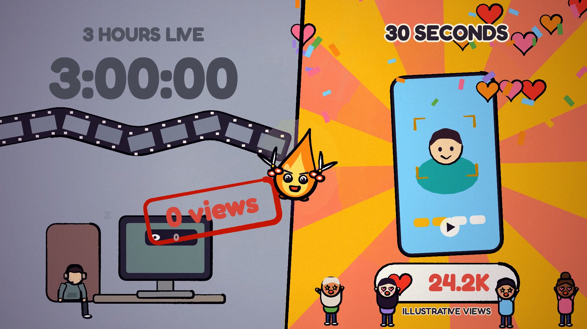

# FlareClip — “Clip It” Watercolor Music Video

[](https://flareclip.com/)

An open-source, frame-by-frame watercolor music video rendered with p5.js, WebGL, Puppeteer, and FFmpeg. One square animation world produces both 9:16 vertical video and 16:9 horizontal video, with beat-aware motion and lyrics aligned to the recorded vocal.

**[Turn long videos into short, shareable clips with FlareClip →](https://flareclip.com/)**

> Music disclosure: “Clip It” was generated with Mureka under a paid plan. The soundtrack is AI-generated. See [Asset licensing](#asset-licensing) before reusing any bundled media or FlareClip brand elements.

## What this project demonstrates

- Deterministic, frame-by-frame p5.js animation in headless Chrome
- A watercolor rendering style built with p5.brush and WebGL
- One animation timeline for 9:16 and 16:9 compositions
- Beat-aware motion driven by detected musical timing
- Vocal-aligned, burned-in English lyrics
- Resumable parallel frame rendering and FFmpeg encoding

The final 2-minute videos are distributed through this repository's GitHub Releases rather than committed to Git. Preview stills are available in [`preview/`](preview/).

## Requirements

- Node.js 18 or newer
- FFmpeg
- Google Chrome or another Chromium-based browser

On macOS, install FFmpeg with:

```bash
brew install ffmpeg
```

The renderer automatically looks for Google Chrome in its standard macOS and Windows locations. For another browser location, pass its executable explicitly:

```bash
node render.mjs --all --edit=2min --chrome="/path/to/chrome"
```

Chrome's sandbox remains enabled by default. Use `--no-sandbox` only inside a trusted, isolated CI or container environment when Chrome cannot launch otherwise.

## Quick start

```bash
npm ci

# Render a three-second vertical benchmark first.
npm run bench

# Render the complete 2-minute MV in vertical and horizontal formats.
npm run render:2min
```

The benchmark prints the active GPU. On Apple Silicon it should contain `Apple` and `Metal`. If it contains `SwiftShader`, retry with a visible Chrome window:

```bash
node render.mjs --all --fmt=v --range=0,3 --out=out/bench.mp4 --headful
```

Completed frames are cached under `out/frames-*`. Re-running the same command skips existing frames, so interrupted renders can resume safely.

## Render options

```bash
# Other edits
npm run render:60s
npm run render:30s
npm run render:15s

# One format only: v = vertical, h = horizontal
node render.mjs --all --edit=2min --fmt=v

# Re-encode already-rendered frames
node render.mjs --encode --edit=2min

# Contact sheet at selected edit times
node render.mjs --sheet=1,20,40,60,80,100,118 --fmt=h --scale=0.5 --out=out/check.jpg

# Character sheets
node render.mjs --model=snip --out=out/model.jpg
node render.mjs --model=cast --fmt=h --out=out/cast.jpg
```

`--workers=3` is the default. Apple Silicon machines can often use 4; reduce it to 2 if the computer becomes unresponsive.

## How it works

- [`src/core.js`](src/core.js) — canvas, camera, deterministic watercolor rendering, typography, paper and grain
- [`src/scenes.js`](src/scenes.js) — intro, first chorus, and outro
- [`src/verse.js`](src/verse.js) — first verse and pre-chorus
- [`src/part2.js`](src/part2.js) — second verse, second chorus, instrumental section, and bridge
- [`src/timeline.js`](src/timeline.js) — edit-time to song-time mapping and vocal-aligned lyrics
- [`src/music.js`](src/music.js) — detected beats and bars
- [`src/chars.js`](src/chars.js) — Snip, FlareClip's flame-and-scissors mascot, and the streamer
- [`src/cast2.js`](src/cast2.js) — Mochi the cat, audience characters, room set, and particles
- [`src/props.js`](src/props.js) — props and environmental details
- [`render.mjs`](render.mjs) — Chrome orchestration, parallel JPEG frame rendering, resume support, and FFmpeg encoding

Each shot is authored in original song time. The edit map selects and rearranges song sections for the 15-second, 30-second, 60-second, and 2-minute cuts while reusing the same animation system.

For quick visual debugging, open `studio.html?fmt=v&edit=2min` in Chrome and run `renderAt(seconds)` in the browser console.

## Output sizes

Full-resolution rendering produces thousands of JPEG frames and can use several gigabytes of local disk space. The entire `out/` directory is intentionally ignored by Git. Keep final MP4 files in GitHub Releases or another media host rather than in repository history.

## Asset licensing

The original rendering source code is available under the [MIT License](LICENSE).

The FlareClip name and visual identity, Snip character, lyrics, soundtrack, preview images, and rendered videos are governed by [`ASSETS_LICENSE.md`](ASSETS_LICENSE.md) and are not included in the MIT grant. No trademark rights are granted.

Third-party components retain their original licenses. See [`THIRD_PARTY_NOTICES.md`](THIRD_PARTY_NOTICES.md) and [`vendor/p5.brush.LICENSE.md`](vendor/p5.brush.LICENSE.md).

Please report security issues privately as described in [`SECURITY.md`](SECURITY.md). Do not include credentials, private media, or other sensitive information in a public issue.

External contributions follow the zero-trust review requirements in [`CONTRIBUTING.md`](CONTRIBUTING.md). Pull-request code is not executed automatically.

## About FlareClip

[FlareClip](https://flareclip.com/) turns long videos into short, shareable clips with viral titles, reframing, captions, and publishing tools.

---

## 中文说明

这是 FlareClip 歌曲《Clip It》的程序化水彩动画 MV。动画由 p5.js、p5.brush 和 WebGL 逐帧绘制，再由 FFmpeg 编码成横版与竖版视频。字幕时间已经依据实际演唱音频校准。

```bash
npm ci
npm run bench
npm run render:2min
```

逐帧缓存和最终 MP4 位于 `out/`，不会提交到 Git。完整成片通过 GitHub Releases 发布。访问 **[FlareClip 官网](https://flareclip.com/)**，了解如何把长视频转换为适合 YouTube Shorts、TikTok 和 Reels 的短片。
